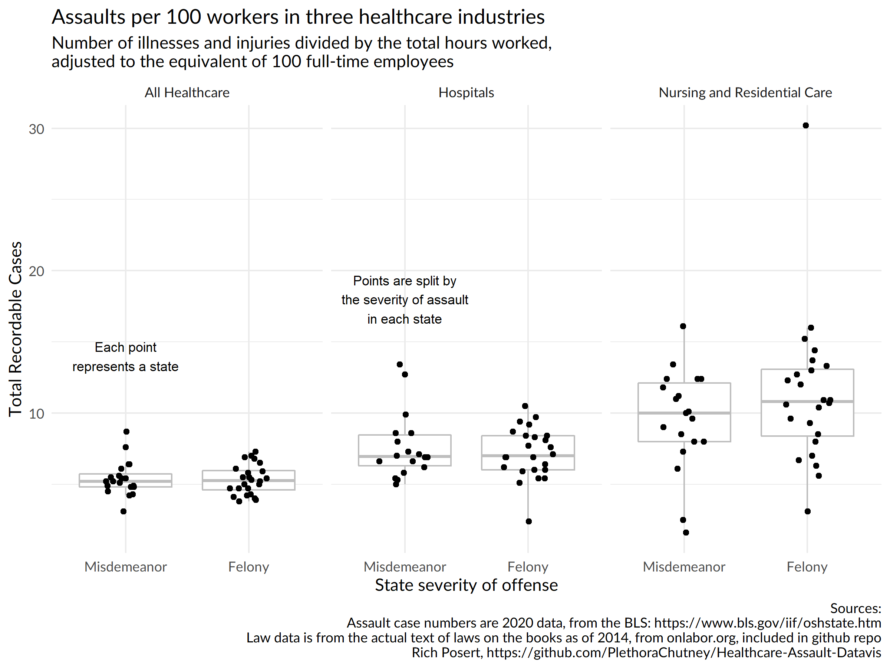

# Assaults in the healthcare industry
It is a tragedy how frequently workers in the healthcare industry
are assaulted. However, increasing the punishment from a misdemeanor
to a felony will do nothing to change that rate. As evidence of this
fact, I present a comparison of assault rates in forty-five states across three industries,
separated by whether those states consider assaulting a healthcare worker
a felony or misdemeanor.

I pulled state-level data from the BLS website using the included scraping
script. State laws are a bit older, pulled from onlabor.org. The PDF with
text of the laws is included in the repo. Any time assault of a nurse, doctor, or ER
staff was a felony I counted it as a felony. I did not count states in which
only assault of EMT was a felony. Other state-level decisions I made are included
in the notes column of `felony-assault.csv`.